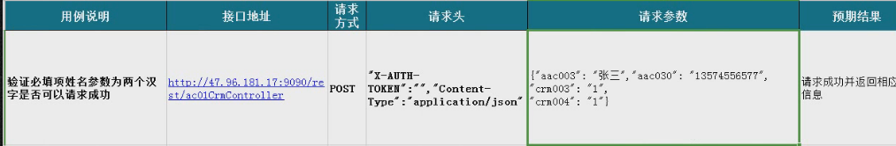

# python搞定Excel测试用例操作

## Excel测试用例自动化流程
### 1、Excel测试用例读取

### 2、接口请求代码构建

### 3、测试结果写入到Excel

### 4、后续一些辅助性工作

- 可以批量执行用例
- 引入框架pytest
- 定制化执行用例
- 分布式执行pytest-xdist
- 定制化allure
- jenkins持续集成
- 迭代回归

