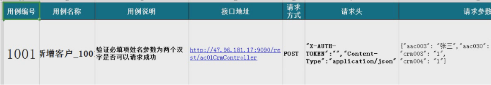
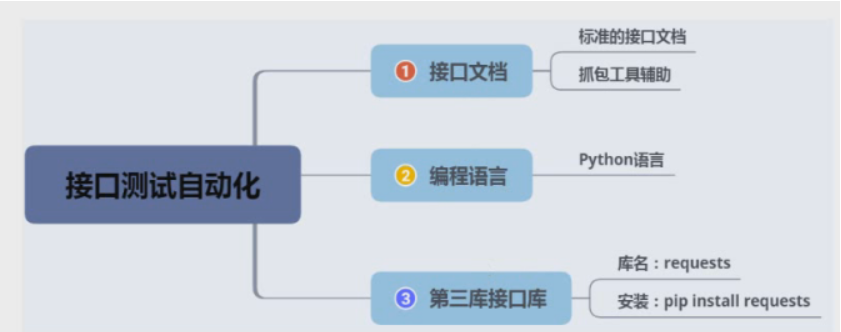
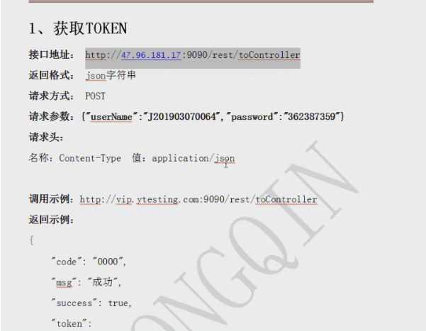
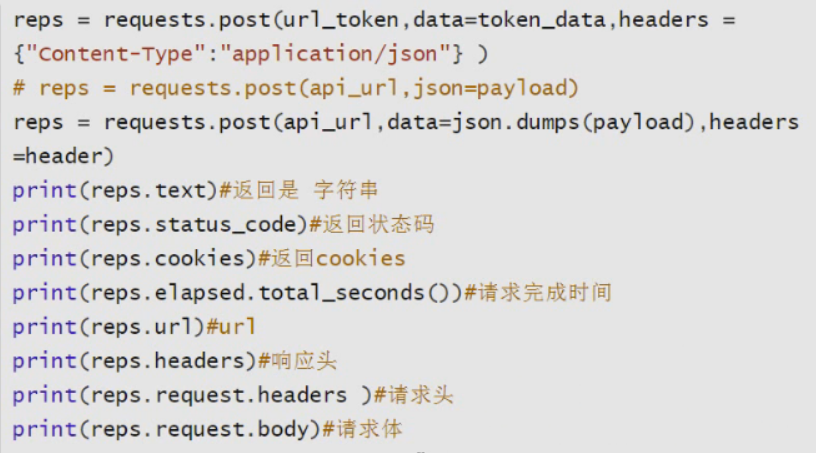

# 接口自动化测试

## 接口自动化测试流程

1. 项目业务
2. 接口文档
3. 接口用例
4. python脚本
5. pytest框架
6. 调试执行
7. Allure报告
8. 结果分析
9. Jenkins集成

## 环境准备



## 编写自动化脚本



```
#Token:令牌，需要账号密码验证获取token值
# body:
#    data:表单格式   data=
#    json:json格式   json=   请求头默认为application/json


# 1、获取token值
import requests
token_url = 'https://www.csdn.net/community/toolbar-api/v1/get-user-info'  # url
payLoad = {"userName": "j201903070064", "password": "362387359"}  # 请求体
head_token = {"Content-Type": 'application/json'}  # 请求头

#发送请求
resp=requests.post(token_url,json=payLoad)
print(resp.json())
# 2、新增用户接口


#python生成随机数
# import random
# print(f'123{random.randint(11111,99999)}')


'''
    优化：
    1-封装
    2-结合测试用例
    3-结合pytest框架
    4-导出allure报告
    5-优化报告
    6-调试
    7-jenkins
    8-邮件通知
'''
```

### requests库响应消息体四种格式

| 四种返回格式            | 说明             | 用处                         |
| ----------------------- | ---------------- | ---------------------------- |
| r.text:文本相应内容     | 返回字符串类型   | 获取网页html时用             |
| r.content:字节响应内容  | 返回字节类型     | 下载图片或文件时用           |
| r.json:json解码相应内容 | 返回字典类型     | 明确服务器返回json数据时才用 |
| r.raw:原始相应内容      | 返回原始格式类型 |                              |



